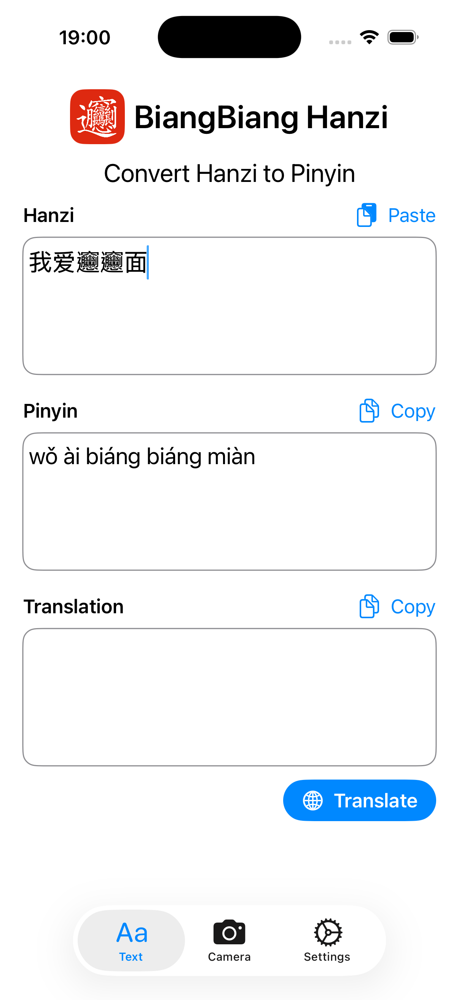
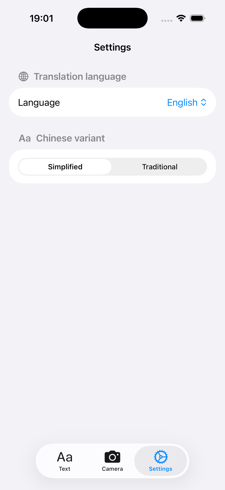

# 𰻝𰻝汉子 BiangBiang Hanzi

## Overview

𰻝𰻝汉子 BiangBiang Hanzi is an application that allows users to convert Hanzi (Chinese characters) to Pinyin and translate Chinese text into any language. It supports both traditional and simplified Chinese characters and includes OCR capabilities for recognizing text from images, either live or from the camera.

This app has been developed using Swift and SwiftUI, leveraging the power of Apple's Vision framework for OCR functionality.

I developed this app to help myself and others learn Chinese more effectively by providing an easy way to read and understand Hanzi characters. It happened many times when I was in China in restaurants for example, I could not read the menu because I did not know how to pronounce the characters; but if I could know the pinyin I would have been able to read it out loud and order food. This app aims to solve that problem as well, aside from being a useful tool for learning Chinese in general.

## Features

- [x] Convert Hanzi to Pinyin
- [x] Translate Chinese to any language
- [x] Support for traditional and simplified Chinese characters
- [x] OCR support for images (both live and from camera)
- [x] OCR support from files (coming soon)
- [ ] Cantonese support (coming soon)

## Download

You can purchase 𰻝𰻝汉子 BiangBiang Hanzi from the App Store (coming soon).

## Gallery

Convert Hanzi to Pinyin and translate.

Configure whether to use traditional or simplified Chinese characters.

## License

This project is licensed under the MIT License. See the [LICENSE](./LICENSE) file for details.
