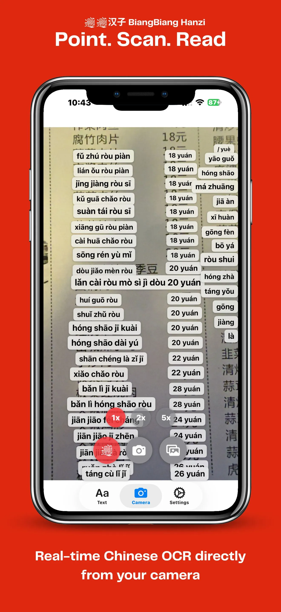

# BiangBiang Hanzi


## Overview

𰻝𰻝汉子 BiangBiang Hanzi is an iOS and Android application that converts Hanzi (Chinese characters) to Pinyin (Mandarin) or Jyutping (Cantonese), and translates Mandarin Chinese text into any language. It supports Simplified, Traditional, and Cantonese variants, and includes OCR capabilities for recognizing text from images, either live or from files. Translation is available for Mandarin only — Cantonese mode provides romanization without translation.

This app has been developed using Swift and SwiftUI, leveraging the power of Apple's Vision framework for OCR functionality.

I developed this app to help myself and others learn Chinese more effectively by providing an easy way to read and understand Hanzi characters. It happened many times when I was in China in restaurants for example, I could not read the menu because I did not know how to pronounce the characters; but if I could know the pinyin I would have been able to read it out loud and order food. This app aims to solve that problem as well, aside from being a useful tool for learning Chinese in general.

## Features

- [x] Convert Hanzi to Pinyin (Mandarin) and Jyutping (Cantonese)
- [x] Translate Chinese to any language (Mandarin only)
- [x] Support for Simplified, Traditional, and Cantonese variants
- [x] OCR support for images (both live and from camera)
- [x] OCR support from files

## Download

You can purchase 𰻝𰻝汉子 BiangBiang Hanzi from the App Store and from the Google Play Store (coming soon).

[](https://apps.apple.com/app/id6754869174)
[](https://play.google.com/store/apps/details?id=dev.veeso.biangbianghanzi)

## Required Tools

- [`swiftformat`](https://github.com/nicklockwood/SwiftFormat) — required for formatting iOS Swift code. Install via Homebrew:

  ```bash
  brew install swiftformat
  ```

## Cantonese data

The Cantonese (Jyutping) dictionary is generated from the Unicode Unihan database. To regenerate `assets/cantonese.json`, see [`tools/cantonese/README.md`](./tools/cantonese/README.md).

## iOS

Format code using

```bash
swiftformat ./ios
```

Run `swiftformat ./ios` whenever iOS code is modified.

## License

This project is licensed under the Elastic V2 license. See the [LICENSE](./LICENSE) file for details.

## Gallery

Convert Hanzi to Pinyin and translate.


Recognize hanzi from live images and convert to Pinyin.


